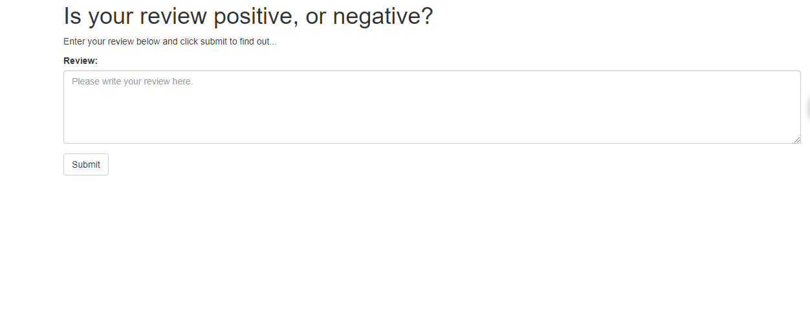
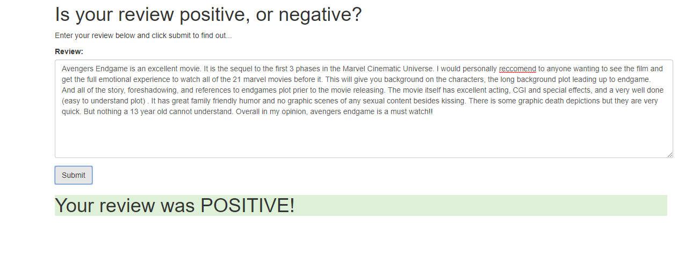
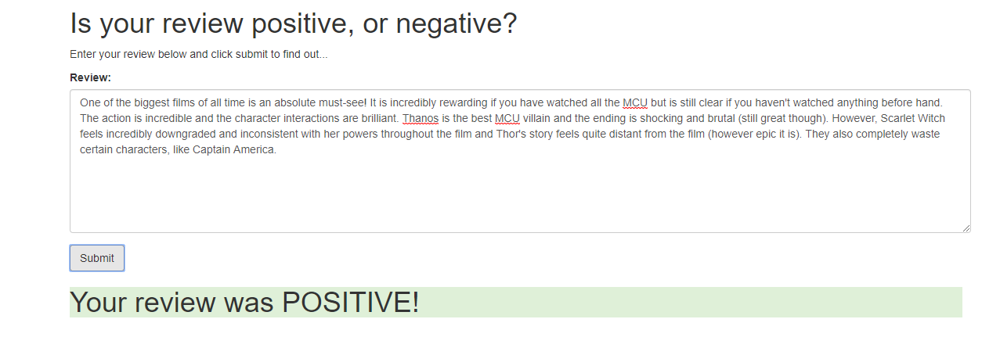
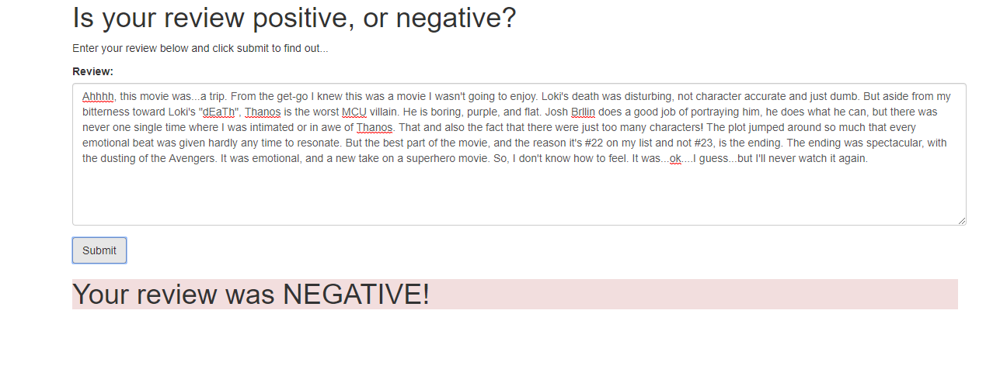

# Sentiment_Analysis_with_deployment_project
This end-to-end project is used for analysis of movie review sentiment and then classify the gives review into _Positive and Negative reviews_.This model is then deploy into **AWS Sagemaker with Flask** on web. It has UI interface which takes users input and then gives the real-time results on the web.

Technologies Used:-
1) Pytorch
2) AWS Sagemaker

 The Web Application Interface Looks like:-
 
 
 We have then tested our model by inputing the reviews which our model correctly predicts as positive
 
 
 
 We have then tested our model by inputing the reviews which our model correctly predicts as negative
 
